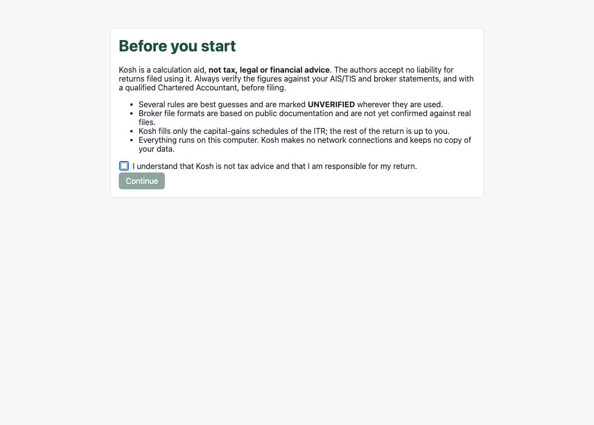
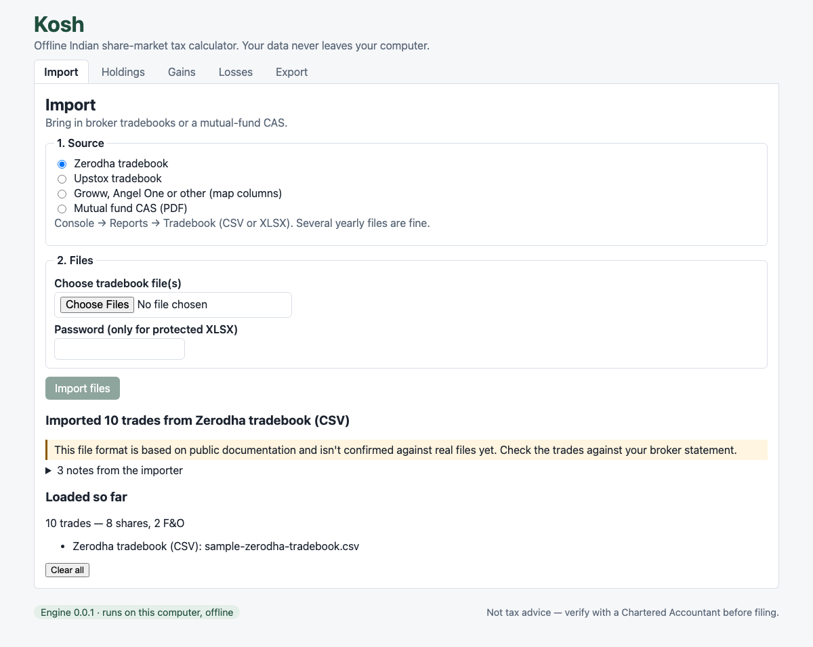
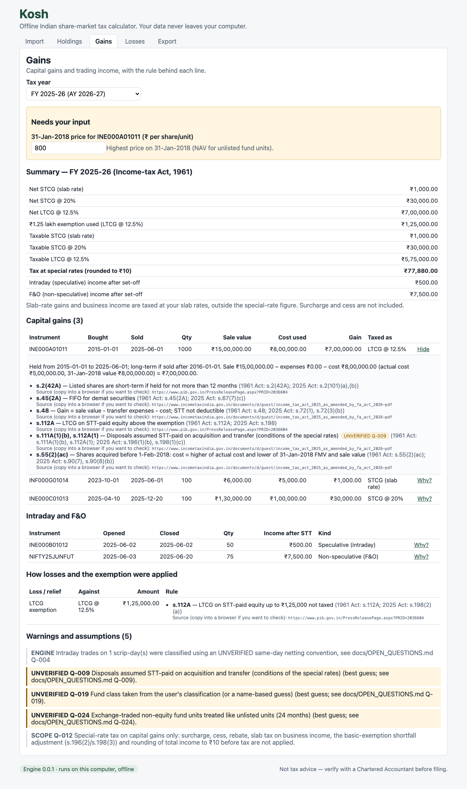
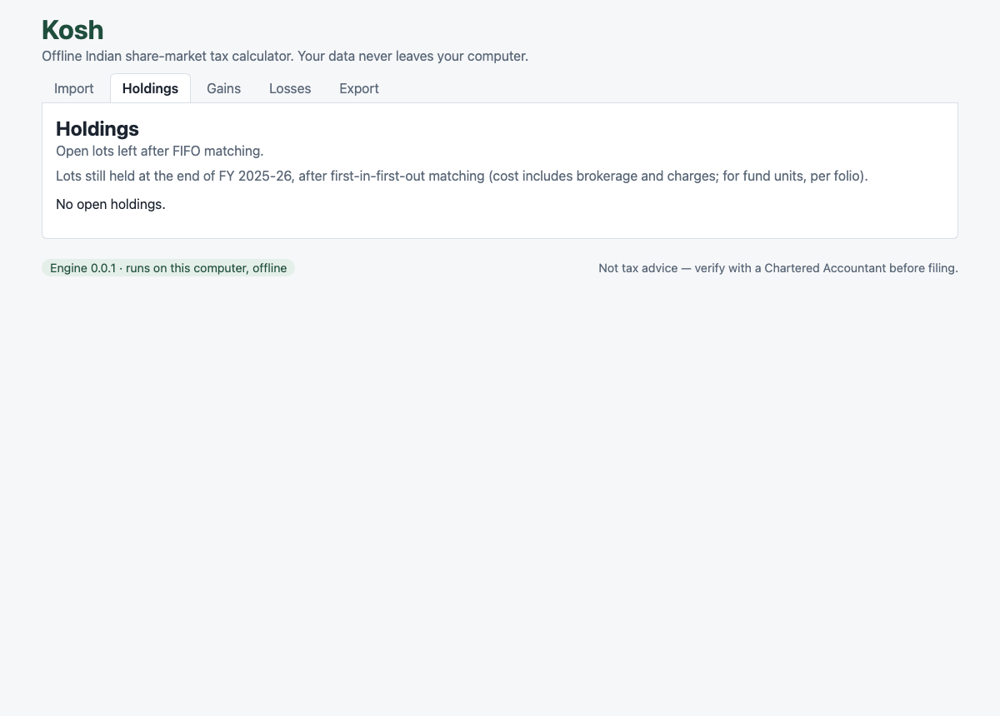
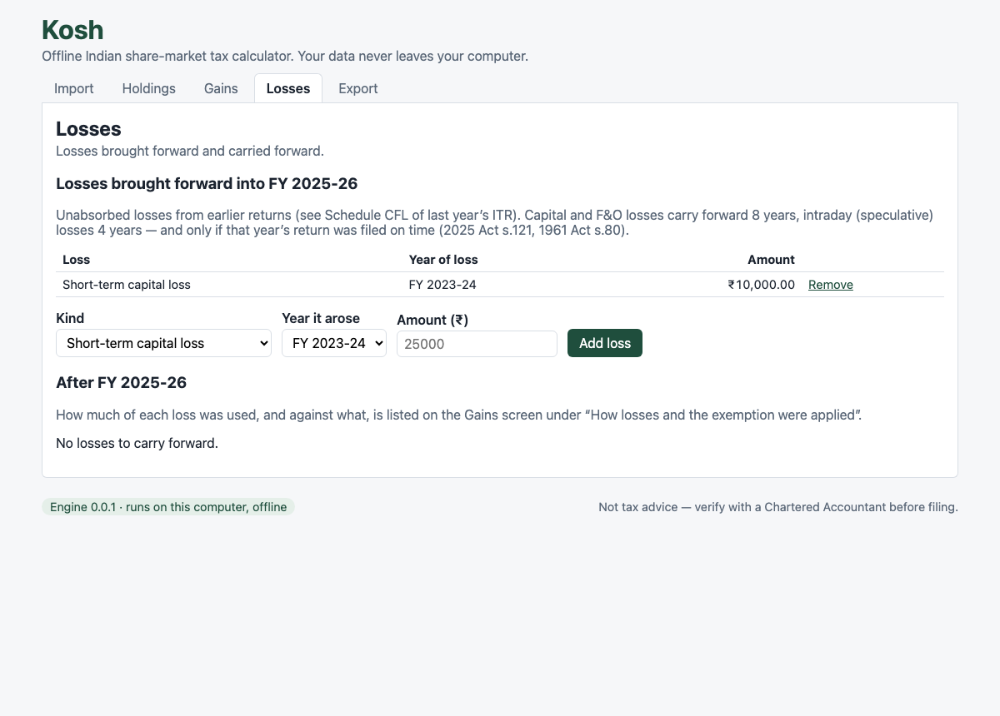
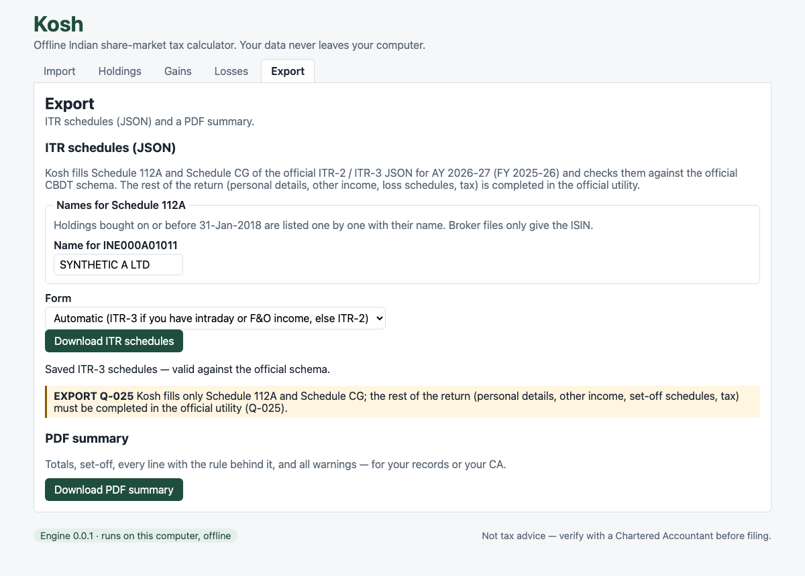

# How to use Kosh

This guide takes you from your broker files to the capital-gains schedules for your return. It
covers every step: starting the app, getting the right files from each broker, importing them,
answering Kosh's questions, checking the figures and exporting them.

> **Not tax advice.** Kosh is a calculation aid. Check every figure against your AIS/TIS and
> with a Chartered Accountant before you file. Rules marked **UNVERIFIED** in the app are best
> guesses that are still being confirmed (see `docs/OPEN_QUESTIONS.md`).

Kosh works fully offline. Your files are read on your own computer and are never uploaded
anywhere.

---

## 1. Start Kosh

### Option A: in your browser, from source (works today)

You need [uv](https://docs.astral.sh/uv/) (Python) and [pnpm](https://pnpm.io/) (Node 20 or
later). This is a one-time setup.

```bash
cd NSE-accounting
uv sync                    # installs the tax engine
pnpm --dir app install     # installs the user interface
```

Each time you want to use Kosh:

```bash
pnpm --dir app dev
```

Open **http://localhost:1420** in your browser. The page talks to the tax engine running on
your own computer. To stop Kosh, press `Ctrl+C` in the terminal.

### Option B: the desktop app

Download the installer for your system from the project's Releases page. `docs/RELEASING.md`
explains how to check that the download is genuine. To build the desktop app yourself you
need Rust; follow the last two lines of the Quick start in `README.md`.

---

## 2. Accept the disclaimer

The first time Kosh opens, it explains what it does and does not do. Read it, tick the box and
continue. It won't appear again on this computer.



---

## 3. Get your files from your broker

Kosh needs your **trade-by-trade history**: every buy and sell. It does not need the ledger
(money in and out of your account), contract notes or the broker's own P&L report.

> **Download your whole history, not just this year.** To work out the gain on a share you sold
> this year, Kosh needs the date and price at which you **bought** it, even if that was years
> ago. Download every year since you opened the account and import all of the files together.

| Broker | Where to find it | Format | Notes |
|---|---|---|---|
| **Zerodha** | Console → Reports → **Tradebook**. Choose the segment (Equity, F&O) and a date range of up to 365 days. | CSV or XLSX | One file per year. Repeat for every year and every segment. |
| **Upstox** | Reports → **Trade report** for each financial year | CSV or XLSX | |
| **Groww** | Profile → Reports → **Transactions**, then download the stocks order history | XLSX | The file is password-protected. The password is your PAN in CAPITALS. |
| **Angel One** | Account → **Trades & Charges** → download trade history | XLSX (the file is usually named `Trades_History.xlsx`) | Includes charges and STT per trade. Has no ISIN; Kosh tracks companies by name. |
| **Mutual funds** | The **Detailed** Consolidated Account Statement (CAS) from CAMS or KFintech, covering the period **since inception** | PDF | You set the password when you request it, usually your PAN. Request the "Detailed" statement, not the summary. |

### What the tradebook does **not** contain

Some events never appear in a tradebook. Check for them yourself:

- **IPO allotments, OFS, buybacks and shares moved in from another broker.** These are
  purchases with no "buy" row. If you sell such shares, Kosh stops with an error like "selling
  100 of … but only 0 held".
- **Splits and bonus issues.** Kosh adjusts for those it knows about. Look over the Holdings
  tab after importing.
- **Brokerage, STT and other charges.** These are not in the tradebook. STT is not deductible
  against capital gains. Ask your CA about expenses against F&O income.

---

## 4. Import your files (Import tab)



1. **Choose the source:**
   - **Zerodha tradebook**
   - **Upstox tradebook**
   - **Angel One trade history**
   - **Groww or other (map columns)**
   - **Mutual fund CAS (PDF)**
2. **Choose the file(s).** You can select several files at once, for example all your yearly
   Zerodha tradebooks for Equity and F&O.
3. **Password**, only if the file is protected:
   - a Groww XLSX: your PAN in capitals
   - a CAS PDF: the password you set when you requested it
4. **Angel One needs nothing extra.** Choose **Angel One trade history**, select your
   `Trades_History.xlsx` file(s) and click **Import files**.
   - **Company names:** the file has no ISIN, only shortened company names (for example
     "EXAMPLE DEPO SER (I)"), so Kosh tracks each company by that name. Gains are worked out
     normally.
   - **Shares bought on or before 31-Jan-2018** can't go into the Schedule 112A export
     without an ISIN, because the official form requires it for them; the export tells you
     which company. Later purchases need no ISIN.
   - **ETFs:** a name that looks like an ETF or fund (for example a gold ETF) gets a warning.
     Without its ISIN, Kosh taxes it as an ordinary share, which is wrong for gold, debt and
     international ETFs.
   - **Charges check:** the per-trade charges are compared with the file's own "Total Trade
     Charges", and Kosh warns you if they differ by more than ₹1. Charges other than STT are
     added to the cost of buys and deducted from sale values. STT is kept separate.
5. **For Groww or another broker, map the columns.** Open your file in Excel or
   Numbers and type the **exact column heading** for each field:

   | Field in Kosh | What it is | Required |
   |---|---|---|
   | Trade date | Date of the trade | ✔ |
   | Buy / sell | The column saying BUY or SELL | ✔ |
   | Quantity | Number of shares or units | ✔ |
   | Price | Price per share | ✔ |
   | Trade / order number | A unique ID for the trade | ✔ |
   | ISIN (shares) | 12-character code such as `INE002A01018`. Needed for shares. | |
   | Contract symbol (F&O) | For example `NIFTY25JUNFUT`. Needed for futures and options. | |
   | Exchange | NSE or BSE | |
   | Segment | Equity, F&O and so on | |
   | Execution time | Time of the trade. It helps tell intraday trades apart. | |

6. Click **Import files**. Kosh lists what it loaded: the number of trades from each file and
   any rows it skipped, with the reason.
7. Repeat for each source. Trades from several brokers are combined.

To start over, click **Clear all**.

**If an import fails**, the message tells you why:

- **Wrong password:** retype it in capitals.
- **Missing column:** check the mapping. Headings must match exactly.
- **CAS opens with an existing balance:** your CAS doesn't start from your first purchase.
  Request one for the period "since inception".
- **Importing the same file twice is harmless.** Trades that are already loaded are skipped,
  and Kosh tells you how many.

---

## 5. Review your gains (Gains tab)



1. **Pick the tax year** at the top:
   - FY 2024-25
   - FY 2025-26
   - TY 2026-27 (the new Income-tax Act 2025)
2. **Answer "Needs your input"** if the panel appears. Kosh won't guess these:
   - **Fund class.** For each ETF or mutual fund, choose:
     - **Equity-oriented:** an equity fund or equity ETF.
     - **Specified:** a debt fund bought on or after 1-Apr-2023, always taxed at your slab rate.
     - **Other:** for example gold ETFs, international funds and FoFs.

     Then click **Confirm**. If you're unsure, the fund's factsheet gives its category.
   - **Price on 31-Jan-2018.** For shares bought on or before 31-Jan-2018, enter the highest
     price quoted on that day. This is the "grandfathering" rule: gains up to that date are not
     taxed. You can find it in the NSE/BSE historical data for 31-Jan-2018, or ask your broker.
3. **Read the Summary:**
   - short-term and long-term capital gains
   - the ₹1.25 lakh LTCG exemption
   - intraday (speculative) income and F&O (non-speculative business) income
   - tax at special rates
4. Click **Why?** next to any line. It shows the buy and sell lots matched (FIFO, oldest
   first), the holding period, the rate used, and the **section of the Act** behind it.
5. **"How losses and the exemption were applied"** shows, step by step, which losses were set
   off against which gains.
6. **Warnings** at the bottom list anything to check, including every **UNVERIFIED** rule that
   affected your figures.

Intraday and F&O income are business income. They go in ITR-3, and your slab tax on them is
worked out in the official utility, not by Kosh.

---

## 6. Check your holdings (Holdings tab)



This tab lists the shares and units Kosh thinks you still hold, with each purchase lot. Compare
it with your broker's holdings page or your demat statement.

**A mismatch usually means a file is missing:**

- an earlier year's tradebook
- a different segment
- an IPO or transfer-in, which never appears in a tradebook

---

## 7. Add losses from earlier years (Losses tab)



If last year's return had unabsorbed losses, enter them here. You'll find them in
**Schedule CFL** of last year's ITR or in your CA's computation.

1. Choose the **Kind**:
   - short-term capital loss
   - long-term capital loss
   - speculative (intraday) loss
   - non-speculative (F&O) loss
2. Choose the **Year it arose**.
3. Enter the **Amount (₹)**, then click **Add loss**.

The Gains tab recalculates straight away. The lower part of this tab shows what is still
carried forward after this year, and anything that has expired:

- capital and F&O losses carry forward for 8 years
- intraday losses carry forward for 4 years

A loss can be carried forward only if that year's return was filed on time.

---

## 8. Export (Export tab)



### ITR schedules (JSON)

1. Under **Names for Schedule 112A**, type the company name for each share bought on or before
   31-Jan-2018. Broker files only give the ISIN.
2. Choose the **Form**:
   - **Automatic** picks ITR-3 if you have intraday or F&O income, otherwise ITR-2.
3. Click **Download ITR schedules**. Kosh checks the file against the official CBDT schema and
   saves it only if it is valid.

Kosh fills **Schedule 112A and Schedule CG only.** Complete the rest of the return in the
official Income Tax utility or on the e-filing portal:

- personal details
- salary and other income
- Schedule CFL
- Schedule BP for F&O and intraday
- tax computation

Copy the figures from Kosh's schedules into the matching schedules there, or give the file to
your CA.

### PDF summary

Click **Download PDF summary**. It contains:

- the totals
- the set-off steps
- every line with the rule behind it
- every warning

Keep it with your records or send it to your CA.

The web version downloads both files to your browser's Downloads folder. The desktop app asks
where to save them.

---

## 9. Try it with the sample file

`docs/howto/sample-zerodha-tradebook.csv` is a **made-up** Zerodha tradebook. Use it to see how
Kosh works before you use your own files.

1. Go to **Import**, choose **Zerodha tradebook**, select the sample file and click
   **Import files**. Kosh loads 10 trades.
2. Go to **Gains** and choose **FY 2025-26**:
   - set the fund class of `INF000G01014` to **Other**, then click **Confirm**
   - enter **800** as the 31-Jan-2018 price of `INE000A01011`
3. You should see:
   - LTCG of ₹7,00,000, less the ₹1,25,000 exemption
   - intraday income of ₹500
   - F&O income of ₹7,500
   - **tax at special rates of ₹77,880**
4. On **Losses**, add a **Short-term capital loss** from **FY 2023-24** of **₹10,000**. The
   tax at special rates falls to **₹75,880**.
5. On **Export**, enter `SYNTHETIC A LTD` as the name and download both files.

---

## 10. Troubleshooting

| Problem | What to do |
|---|---|
| The badge at the bottom says "Engine unavailable" | Run `uv sync` once, then restart `pnpm --dir app dev`. |
| Port 1420 is already in use | Another copy of Kosh is running. Close it, or use the address it is already on. |
| You see an error "selling … but only … held" | Import earlier years' tradebooks. If the shares came from an IPO or a transfer-in, the buy is not in any tradebook; ask your CA how to record the cost. |
| Holdings don't match your demat | A file is missing. See section 6. |
| Figures differ from your broker's tax P&L | Click **Why?** to see the lots matched. Brokers sometimes ignore grandfathering, or use different dates for the 23-Jul-2024 rate change. |
| An **UNVERIFIED** warning appears | The rule is Kosh's best reading of the law but is not yet confirmed. Show the warning to your CA. Each one has a number (Q-…) in `docs/OPEN_QUESTIONS.md`. |

## Current limitations

- **Formats not yet confirmed.** The Upstox format was built from public documentation and has
  not been tested on real files. Groww needs column mapping. If an import fails, please share
  an **anonymised** sample.
- **Angel One: shares only.** Kosh imports cash-market (delivery and intraday) trades from the
  Angel One trade history. F&O rows are skipped with a warning until their layout is
  confirmed.
- **Sales of shares bought before your first file stop the calculation.** The Gains tab shows
  "selling … but only … held". Import the earlier years' files too. A form for entering
  missing purchases is planned.
- **Schedules only.** Kosh exports only the capital-gains schedules (112A and CG), not a
  complete return.
- **UNVERIFIED rules.** Some rules are best guesses until a CA reviews them (see
  `docs/OPEN_QUESTIONS.md`).
